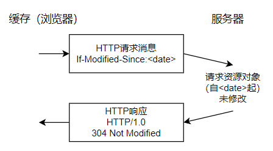

这篇文章会从下面几个维度来对比 HTTP 1.0 和 HTTP 1.1：

- 响应状态码
- 缓存处理
- 连接方式
- Host 头处理
- 带宽优化

## 响应状态码

HTTP/1.0 仅定义了 16 种状态码。HTTP/1.1 中新加入了大量的状态码，光是错误响应状态码就新增了 24 种。比如说，`100 (Continue)`——在请求大资源前的预热请求，`206 (Partial Content)`——范围请求的标识码，`409 (Conflict)`——请求与当前资源的规定冲突，`410 (Gone)`——资源已被永久转移，而且没有任何已知的转发地址。

## 缓存处理

缓存技术通过避免用户与源服务器的频繁交互，节约了大量的网络带宽，降低了用户接收信息的延迟。

### HTTP/1.0

HTTP/1.0 提供的缓存机制非常简单。服务器端使用`Expires`标签来标志（时间）一个响应体，在`Expires`标志时间内的请求，都会获得该响应体缓存。服务器端在初次返回给客户端的响应体中，有一个`Last-Modified`标签，该标签标记了被请求资源在服务器端的最后一次修改。在请求头中，使用`If-Modified-Since`标签，该标签标志一个时间，意为客户端向服务器进行问询：“该时间之后，我要请求的资源是否有被修改过？”通常情况下，请求头中的`If-Modified-Since`的值即为上一次获得该资源时，响应体中的`Last-Modified`的值。

如果服务器接收到了请求头，并判断`If-Modified-Since`时间后，资源确实没有修改过，则返回给客户端一个`304 not modified`响应头，表示”缓冲可用，你从浏览器里拿吧！”。

如果服务器判断`If-Modified-Since`时间后，资源被修改过，则返回给客户端一个`200 OK`的响应体，并附带全新的资源内容，表示”你要的我已经改过的，给你一份新的”。




### HTTP/1.1

HTTP/1.1 的缓存机制在 HTTP/1.0 的基础上，大大增加了灵活性和扩展性。基本工作原理和 HTTP/1.0 保持不变，而是增加了更多细致的特性。其中，请求头中最常见的特性就是`Cache-Control`，详见 MDN Web 文档 [Cache-Control](https://developer.mozilla.org/zh-CN/docs/Web/HTTP/Headers/Cache-Control).

## 连接方式

**HTTP/1.0 默认使用短连接** ，也就是说，客户端和服务器每进行一次 HTTP 操作，就建立一次连接，任务结束就中断连接。当客户端浏览器访问的某个 HTML 或其他类型的 Web 页中包含有其他的 Web 资源（如 JavaScript 文件、图像文件、CSS 文件等），每遇到这样一个 Web 资源，浏览器就会重新建立一个 TCP 连接，这样就会导致有大量的“握手报文”和“挥手报文”占用了带宽。

**为了解决 HTTP/1.0 存在的资源浪费的问题， HTTP/1.1 优化为默认长连接模式 。** 采用长连接模式的请求报文会通知服务端：“我向你请求连接，并且连接成功建立后，请不要关闭”。因此，该 TCP 连接将持续打开，为后续的客户端-服务端的数据交互服务。也就是说在使用长连接的情况下，当一个网页打开完成后，客户端和服务器之间用于传输 HTTP 数据的 TCP 连接不会关闭，客户端再次访问这个服务器时，会继续使用这一条已经建立的连接。

如果 TCP 连接一直保持的话也是对资源的浪费，因此，一些服务器软件（如 Apache）还会支持超时时间的时间。在超时时间之内没有新的请求达到，TCP 连接才会被关闭。

有必要说明的是，HTTP/1.0 仍提供了长连接选项，即在请求头中加入`Connection: Keep-alive`。同样的，在 HTTP/1.1 中，如果不希望使用长连接选项，也可以在请求头中加入`Connection: close`，这样会通知服务器端：“我不需要长连接，连接成功后即可关闭”。

**HTTP 协议的长连接和短连接，实质上是 TCP 协议的长连接和短连接。**

**实现长连接需要客户端和服务端都支持长连接。**

## Host 头处理

域名系统（DNS）允许多个主机名绑定到同一个 IP 地址上，但是 HTTP/1.0 并没有考虑这个问题，假设我们有一个资源 URL 是http://example1.org/home.html，HTTP/1.0的请求报文中，将会请求的是`GET /home.html HTTP/1.0`.也就是不会加入主机名。这样的报文送到服务器端，服务器是理解不了客户端想请求的真正网址。

因此，HTTP/1.1 在请求头中加入了`Host`字段。加入`Host`字段的报文头部将会是:

```
GET /home.html HTTP/1.1
Host: example1.org
```

这样，服务器端就可以确定客户端想要请求的真正的网址了。

## 带宽优化

### 范围请求

HTTP/1.1 引入了范围请求（range request）机制，以避免带宽的浪费。当客户端想请求一个文件的一部分，或者需要继续下载一个已经下载了部分但被终止的文件，HTTP/1.1 可以在请求中加入`Range`头部，以请求（并只能请求字节型数据）数据的一部分。服务器端可以忽略`Range`头部，也可以返回若干`Range`响应。

如果一个响应包含部分数据的话，那么将带有`206 (Partial Content)`状态码。该状态码的意义在于避免了 HTTP/1.0 代理缓存错误地把该响应认为是一个完整的数据响应，从而把他当作为一个请求的响应缓存。

在范围响应中，`Content-Range`头部标志指示出了该数据块的偏移量和数据块的长度。

### 状态码 100

HTTP/1.1 中新加入了状态码`100`。该状态码的使用场景为，存在某些较大的文件请求，服务器可能不愿意响应这种请求，此时状态码`100`可以作为指示请求是否会被正常响应，过程如下图：


然而在 HTTP/1.0 中，并没有`100 (Continue)`状态码，要想触发这一机制，可以发送一个`Expect`头部，其中包含一个`100-continue`的值。

### 压缩

许多格式的数据在传输时都会做预压缩处理。数据的压缩可以大幅优化带宽的利用。然而，HTTP/1.0 对数据压缩的选项提供的不多，不支持压缩细节的选择，也无法区分端到端（end-to-end）压缩或者是逐跳（hop-by-hop）压缩。

HTTP/1.1 则对内容编码（content-codings）和传输编码（transfer-codings）做了区分。内容编码总是端到端的，传输编码总是逐跳的。

HTTP/1.0 包含了`Content-Encoding`头部，对消息进行端到端编码。HTTP/1.1 加入了`Transfer-Encoding`头部，可以对消息进行逐跳传输编码。HTTP/1.1 还加入了`Accept-Encoding`头部，是客户端用来指示他能处理什么样的内容编码。

## 总结

1. **连接方式** : HTTP 1.0 为短连接，HTTP 1.1 支持长连接。
1. **状态响应码** : HTTP/1.1 中新加入了大量的状态码，光是错误响应状态码就新增了 24 种。比如说，`100 (Continue)`——在请求大资源前的预热请求，`206 (Partial Content)`——范围请求的标识码，`409 (Conflict)`——请求与当前资源的规定冲突，`410 (Gone)`——资源已被永久转移，而且没有任何已知的转发地址。
1. **缓存处理** : 在 HTTP1.0 中主要使用 header 里的 If-Modified-Since,Expires 来做为缓存判断的标准，HTTP1.1 则引入了更多的缓存控制策略例如 Entity tag，If-Unmodified-Since, If-Match, If-None-Match 等更多可供选择的缓存头来控制缓存策略。
1. **带宽优化及网络连接的使用** :HTTP1.0 中，存在一些浪费带宽的现象，例如客户端只是需要某个对象的一部分，而服务器却将整个对象送过来了，并且不支持断点续传功能，HTTP1.1 则在请求头引入了 range 头域，它允许只请求资源的某个部分，即返回码是 206（Partial Content），这样就方便了开发者自由的选择以便于充分利用带宽和连接。
1. **Host 头处理** : HTTP/1.1 在请求头中加入了`Host`字段。

## 参考资料

[Key differences between HTTP/1.0 and HTTP/1.1](http://www.ra.ethz.ch/cdstore/www8/data/2136/pdf/pd1.pdf)

<!-- @include: @article-footer.snippet.md -->